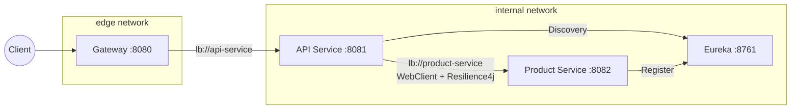

# Microservices Platform – Spring Cloud Gateway, Eureka, API & Product Service

A modular microservices system built with **Spring Boot 3**, **Spring Cloud**, **Java 21** and **Docker Compose**.

It demonstrates:

- API Gateway as the single public entry point
- Service discovery via Eureka
- REST API with CRUD, paging, sorting and filtering
- Database service with H2 + JPA + Flyway migrations
- JWT-based authentication (HS256)
- Correlation ID propagation across services
- Resilience4j (timeouts, retries, circuit breaker)
- In-memory IP rate limiting in the gateway
- Multi-stage Docker images with health checks

---

## Table of Contents
- [1. Configuration & Environment](#1-configuration--environment)
    - [1.1 .env file](#11-env-file)
- [2. Building & Running](#2-building--running)
    - [2.1 Prerequisites](#21-prerequisites)
    - [2.2 Build Docker Images](#22-build-docker-images)
    - [2.3 Start the Stack](#23-start-the-stack)
    - [2.4 Stop & Clean Up](#24-stop--clean-up)
- [3. JWT Authentication](#3-jwt-authentication)
    - [3.1 Generate a Token (PowerShell)](#31-generate-a-token-powershell)
- [4. Architecture](#4-architecture)
    - [4.1 High-level Diagram](#41-high-level-diagram)
- [5. Services](#5-services)
    - [5.1 Gateway](#51-gateway)
    - [5.2 API Service](#52-api-service)
    - [5.3 Product Service](#53-product-service)
    - [5.4 Eureka](#54-eureka)
    - [5.5 Common Module](#55-common-module)
- [6. Project Layout](#6-project-layout)
- [7. API Usage](#7-api-usage)
    - [7.1 Swagger UI](#71-swagger-ui)
    - [7.2 Example Requests (PowerShell + curl.exe)](#72-example-requests-powershell--curlexe)
        - [7.2.1 List Products](#721-list-products)
        - [7.2.2 Filtering](#722-filtering)
        - [7.2.3 Create / Get / Update / Delete](#723-create--get--update--delete)
- [8. Chaos & Resilience](#8-chaos--resilience)
    - [8.1 Chaos Endpoint](#81-chaos-endpoint)
- [9. Correlation IDs](#9-correlation-ids)
- [10. Rate Limiting](#10-rate-limiting)
- [11. Testing](#11-testing)
    - [11.1 Smoke Test Script](#111-smoke-test-script)
    - [11.2 Maven Tests](#112-maven-tests)
- [12. Troubleshooting](#12-troubleshooting)

---

## 1. Configuration & Environment

### 1.1 `.env` file

Create `.env` in the project root:

```bash
cp .env.example .env
```

Default variables:

```env
JWT_SECRET=dev-secret-32-bytes-minimum-key-please!
GATEWAY_PORT=8080
GATEWAY_RL_CAPACITY=20
GATEWAY_RL_REFILL_TOKENS=20
GATEWAY_RL_REFILL_DURATION=10s
```

**Notes:**

- `JWT_SECRET` must be at least **32 bytes** for HS256.
- Adjust rate limiting parameters as needed (capacity, refill tokens, interval).
- `GATEWAY_PORT` controls the port exposed on the host.

<p style="text-align:right">
  <a href="#table-of-contents" style="
      background:#0366d6;
      color:white;
      padding:6px 12px;
      border-radius:6px;
      text-decoration:none;">
    ⬆ Back to Table of Contents
  </a>
</p>

---

## 2. Building & Running

### 2.1 Prerequisites

- Docker Desktop (or compatible engine) with Docker Compose
- Java toolchain only required for local Maven build (not for Docker-only usage)
- Optional: PowerShell 5.1+ or 7+ for helper scripts

### 2.2 Build Docker Images

From repository root:

```bash
docker compose build
```

Each service has its own multi-stage Dockerfile:

- Build stage: Maven build and tests
- Runtime stage:
    - Minimal JRE image
    - Non-root user
    - HEALTHCHECK

### 2.3 Start the Stack

```bash
docker compose up -d
```

Check container status:

```bash
docker compose ps
```

Typical state:

- `gateway` – healthy
- `api` – healthy
- `product-service` – healthy
- `eureka` – healthy

Gateway will be reachable at:

```text
http://localhost:8080
```

> API and Product Service ports are **not** published to the host and are only accessible via gateway.

### 2.4 Stop & Clean Up

```bash
docker compose down -v
```

<p style="text-align:right">
  <a href="#table-of-contents" style="
      background:#0366d6;
      color:white;
      padding:6px 12px;
      border-radius:6px;
      text-decoration:none;">
    ⬆ Back to Table of Contents
  </a>
</p>

---

## 3. JWT Authentication

The API service works as a JWT **resource server** with HMAC-SHA256 (HS256).  
The signing key is taken from `JWT_SECRET`.

### 3.1 Generate a Token (PowerShell)

From the repository root:

```powershell
$env:JWT_SECRET = "dev-secret-32-bytes-minimum-key-please!"
$TOKEN = ./scripts/make-jwt.ps1
$TOKEN | Set-Clipboard
```

Use the token in requests:

```http
Authorization: Bearer <token>
```

<p style="text-align:right">
  <a href="#table-of-contents" style="
      background:#0366d6;
      color:white;
      padding:6px 12px;
      border-radius:6px;
      text-decoration:none;">
    ⬆ Back to Table of Contents
  </a>
</p>

---

## 4. Architecture

### 4.1 High-level Diagram



**Key points:**

- Only the **Gateway** is exposed to the host.
- **API** and **Product Service** are reachable only on the internal Docker network.
- All inter-service communication uses **service names** (via Eureka + LoadBalancer), not raw host/port.

<p style="text-align:right">
  <a href="#table-of-contents" style="
      background:#0366d6;
      color:white;
      padding:6px 12px;
      border-radius:6px;
      text-decoration:none;">
    ⬆ Back to Table of Contents
  </a>
</p>

---

## 5. Services

### 5.1 Gateway

**Tech stack:** Spring Cloud Gateway, Spring Boot, Actuator

**Responsibilities:**

- Single edge entry point (`http://localhost:${GATEWAY_PORT:-8080}`)
- Routes `/api/**` to the API service via `lb://api-service`
- Proxies `/swagger-ui/**` and `/v3/api-docs/**` to the API service
- In-memory **IP-based token-bucket rate limiting**
- Adds/forwards `X-Correlation-ID` header
- Exposes minimal Actuator endpoints (`/actuator/health`, `/actuator/info`)

---

### 5.2 API Service

**Tech stack:** Spring Boot, Spring WebFlux, Spring Security (OAuth2 Resource Server), WebClient, Resilience4j,
springdoc-openapi

**Responsibilities:**

- REST API for **Product** resources
- CRUD + paging + multi-field sorting + filtering
- Bean Validation with clear error responses
- JWT validation as **OAuth2 Resource Server** (HS256, secret from `JWT_SECRET`)
- OpenAPI 3 + Swagger UI configuration with Bearer auth
- Calls the Product Service via `@LoadBalanced WebClient` using service name `product-service`
- Resilience4j integration:
    - Request timeouts
    - Retry
    - Circuit breaker on downstream calls
- Propagation and logging of `X-Correlation-ID`
- Chaos orchestration endpoint `/dev/chaos` (calls downstream chaos in Product Service)

**Main endpoints (via gateway):**

- `GET /api/products`
    - Query params:
        - `page`, `size`
        - `sort` – e.g. `sort=name,asc&sort=price,desc`
        - `name` – filter by name (contains/like)
        - `category` – filter by category
- `GET /api/products/{id}`
- `POST /api/products`
- `PUT /api/products/{id}`
- `DELETE /api/products/{id}`
- `GET /dev/chaos?delayMs=...&errorRate=...` – triggers controlled chaos scenario

All these endpoints expect a valid JWT (except Swagger/OpenAPI & health/info, which are public).

---

### 5.3 Product Service

**Tech stack:** Spring Boot, Spring MVC, Spring Data JPA, H2, Flyway

**Responsibilities:**

- Persistent storage for product data
- H2 in-memory database (with Flyway migrations)
- Exposes internal REST CRUD endpoints for products
- Provides a dedicated **chaos endpoint** to simulate latency and random failures
- Uses global exception handling to return a standardized error format

**Domain model (simplified):**

- `Product`:
    - `id` – primary key
    - `name`
    - `category`
    - `price`
    - `description`

**Chaos:**

- `GET /dev/chaos?delayMs={ms}&errorRate={0..1}`
    - Sleeps for `delayMs` ms
    - Throws errors with given probability `errorRate`
    - Used by the API service to test retry and circuit breaker behavior

---

### 5.4 Eureka

**Tech stack:** Spring Cloud Netflix Eureka Server

**Responsibilities:**

- Service registry for API and Product services
- Maintains service instance list and health
- Used by the Gateway and API service to resolve service names to instances

---

### 5.5 Common Module

Shared module used by API and Product services:

- `CorrelationIdConstants` – header/MDC key names
- `CorrelationIdFilter` – servlet filter that:
    - Reads `X-Correlation-ID` or generates a new UUID
    - Stores the ID in MDC and sends it back in response header
- `ApiErrorResponse` + `ValidationErrorDetails` – unified error payloads

<p style="text-align:right">
  <a href="#table-of-contents" style="
      background:#0366d6;
      color:white;
      padding:6px 12px;
      border-radius:6px;
      text-decoration:none;">
    ⬆ Back to Table of Contents
  </a>
</p>

---

## 6. Project Layout

The project is a multi-module Maven build. Modules live directly in the repository root:

```text
.
├── api/
├── product-service/
├── gateway/
├── eureka/
├── common/
├── scripts/
│   ├── make-jwt.ps1
│   └── smoke.ps1
├── docker-compose.yml
├── pom.xml
├── .env.example
└── README.md
```

<p style="text-align:right">
  <a href="#table-of-contents" style="
      background:#0366d6;
      color:white;
      padding:6px 12px;
      border-radius:6px;
      text-decoration:none;">
    ⬆ Back to Table of Contents
  </a>
</p>

---

## 7. API Usage

All public traffic goes through the gateway.

### 7.1 Swagger UI

Open:

```text
http://localhost:8080/swagger-ui/index.html
```

Then:

1. Click **Authorize** (padlock icon).
2. Paste: `Bearer <your-token>` (including the `Bearer` prefix).
3. Confirm and start calling endpoints.

---

### 7.2 Example Requests (PowerShell + curl.exe)

Assume:

```powershell
$BASE = "http://localhost:8080"
$TOKEN = ./scripts/make-jwt.ps1
$AUTH = "Authorization: Bearer $TOKEN"
```

#### 7.2.1 List Products
*(with paging + sorting)*

```powershell
curl.exe -H $AUTH `
  "$BASE/api/products?page=0`&size=5`&sort=name,asc`&sort=price,desc"
```

#### 7.2.2 Filtering

By name:

```powershell
curl.exe -H $AUTH `
  "$BASE/api/products?name=chair"
```

By category:

```powershell
curl.exe -H $AUTH `
  "$BASE/api/products?category=Electronics"
```

#### 7.2.3 Create / Get / Update / Delete

Create:

```powershell
curl.exe -X POST -H $AUTH -H "Content-Type: application/json" `
  -d '{"name":"Desk Lamp","category":"Electronics","price":129.99,"description":"LED"}' `
  "$BASE/api/products"
```

Get:

```powershell
curl.exe -H $AUTH "$BASE/api/products/1"
```

Update:

```powershell
curl.exe -X PUT -H $AUTH -H "Content-Type: application/json" `
  -d '{"name":"Desk Lamp XL","category":"Electronics","price":159.99,"description":"LED XL"}' `
  "$BASE/api/products/1"
```

Delete:

```powershell
curl.exe -X DELETE -H $AUTH "$BASE/api/products/1"
```

<p style="text-align:right">
  <a href="#table-of-contents" style="
      background:#0366d6;
      color:white;
      padding:6px 12px;
      border-radius:6px;
      text-decoration:none;">
    ⬆ Back to Table of Contents
  </a>
</p>

---

## 8. Chaos & Resilience

### 8.1 Chaos Endpoint

The Product Service exposes:

```text
GET /dev/chaos?delayMs={ms}&errorRate={0..1}
```

The API service provides a `/dev/chaos` endpoint that delegates to Product Service using WebClient with:

- Timeout
- Retry
- Circuit breaker

Example call via gateway:

```bash
curl -H "Authorization: Bearer $TOKEN"   "http://localhost:8080/dev/chaos?delayMs=1500&errorRate=0.5"
```

Observe:

- Logs in API for retries and circuit breaker state changes
- Error responses when downstream failures are simulated

<p style="text-align:right">
  <a href="#table-of-contents" style="
      background:#0366d6;
      color:white;
      padding:6px 12px;
      border-radius:6px;
      text-decoration:none;">
    ⬆ Back to Table of Contents
  </a>
</p>

---

## 9. Correlation IDs

Correlation IDs are propagated using `X-Correlation-ID` header.

Behavior:

- If the incoming request has `X-Correlation-ID`, it is reused.
- If it is missing, a new UUID is generated by the filter.
- ID is stored in MDC and included in logs for tracing.
- API and Product Service both log using `%X{correlationId}`.
- Gateway also forwards/sets the same header.

Example:

```bash
curl -H "Authorization: Bearer $TOKEN"      -H "X-Correlation-Id: demo-corr-123"      "http://localhost:8080/api/products?page=0&size=1"
```

You should see the same `demo-corr-123` in:

- Response header `X-Correlation-ID`
- Logs of API and Product Service

<p style="text-align:right">
  <a href="#table-of-contents" style="
      background:#0366d6;
      color:white;
      padding:6px 12px;
      border-radius:6px;
      text-decoration:none;">
    ⬆ Back to Table of Contents
  </a>
</p>

---

## 10. Rate Limiting

The gateway uses an in-memory token bucket per client IP.

Configuration (from `.env`):

- `GATEWAY_RL_CAPACITY` – bucket size (max tokens)
- `GATEWAY_RL_REFILL_TOKENS` – tokens to add each refill
- `GATEWAY_RL_REFILL_DURATION` – refill interval (e.g. `10s`)

Responses include:

- `X-RateLimit-Limit`
- `X-RateLimit-Remaining`

When the bucket is empty, the gateway returns:

```http
429 Too Many Requests
```

Example stress test (bash):

```bash
for i in {1..20}; do
  curl -s -o /dev/null -w "code:%{http_code} time:%{time_total}\n" \
    -H "Authorization: Bearer $TOKEN" \
    "http://localhost:8080/api/products"
done
```

You should see some `429` responses once your capacity is exhausted.

<p style="text-align:right">
  <a href="#table-of-contents" style="
      background:#0366d6;
      color:white;
      padding:6px 12px;
      border-radius:6px;
      text-decoration:none;">
    ⬆ Back to Table of Contents
  </a>
</p>

---

## 11. Testing

### 11.1 Smoke Test Script

With the stack running:

```powershell
powershell -NoProfile -ExecutionPolicy Bypass -File scripts/smoke.ps1
```

The script performs:

1. Gateway health check.
2. OpenAPI/Swagger availability checks.
3. Request to `/api/products` **without** JWT (expects 401).
4. Request to `/api/products` **with** JWT (expects 200).
5. Burst of requests to observe rate limiting.
6. Chaos endpoint invocation to verify resilience configuration.

---

### 11.2 Maven Tests

Run all tests:

```bash
mvn test
```

Or per module:

```bash
mvn -pl common,api,product-service,gateway,eureka test
```

#### Common

- Correlation filter behavior
- Error DTO serialization

#### API

- Controller tests (REST behavior)
- Service tests (business logic)
- WebClient configuration & resilience aspects
- Security configuration (secured vs public paths)
- Integration tests for main flows and chaos

#### Product Service

- CRUD service & controller tests
- Mapper tests (entity ↔ DTO)
- Global exception handler tests
- Chaos controller/service tests

#### Gateway

- Rate limiter filter tests
- Correlation ID filter tests
- Routing/integration tests

#### Eureka

- Basic context load tests

<p style="text-align:right">
  <a href="#table-of-contents" style="
      background:#0366d6;
      color:white;
      padding:6px 12px;
      border-radius:6px;
      text-decoration:none;">
    ⬆ Back to Table of Contents
  </a>
</p>

---

## 12. Troubleshooting

### 401 Unauthorized

- Check that you are sending `Authorization: Bearer <token>`.
- Make sure `JWT_SECRET` in `.env` matches the secret used to generate the token.
- Regenerate token using `scripts/make-jwt.ps1`.

### Swagger UI does not show endpoints

- Confirm that the API service container is **healthy**:
  ```bash
  docker compose ps
  ```
- Check API and Gateway logs:
  ```bash
  docker compose logs api
  docker compose logs gateway
  ```

### 429 Too Many Requests

- Gateway rate limiter is working as expected.
- Adjust the rate limiting settings in `.env` if needed:
    - `GATEWAY_RL_CAPACITY`
    - `GATEWAY_RL_REFILL_TOKENS`
    - `GATEWAY_RL_REFILL_DURATION`

### Gateway returns 5xx

- Check Eureka status and registrations.
- Inspect logs for `api` and `product-service` for exceptions.
- Ensure Docker networks are up and containers can resolve each other by service name.

<p style="text-align:right">
  <a href="#table-of-contents" style="
      background:#0366d6;
      color:white;
      padding:6px 12px;
      border-radius:6px;
      text-decoration:none;">
    ⬆ Back to Table of Contents
  </a>
</p>

---

This README is intended as a complete technical guide for running, understanding and extending the microservices
platform.  
Feel free to adapt, extend or integrate additional services while reusing the existing patterns for discovery, security,
resilience and observability.
